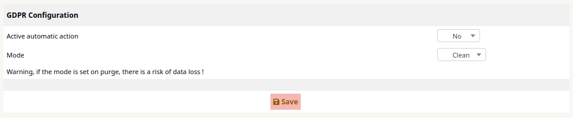
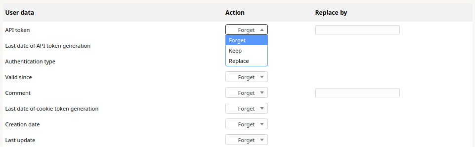
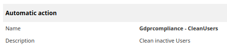
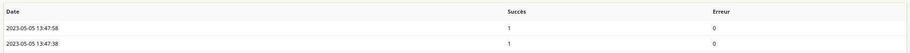

# ITSM Gdprcompliance

## Purpose

This plugin allows you to clean inactive users data from your ITSM-NG instance.

## Installation

Installing this plugin is done following the standard process for itsm plugins, simply clone the git or download a release and place it within itsm's `plugins` folder.

Don't forget to set Apache rights, and enjoy !

## Usage

To configure the plugin execution mode, go to `Tools > GDPR Configuration > Setup`.

**Active automatic action** : Enable or disable the automatic action execution.

**Mode** : Select the cleaning mode 

- `Clean` : Moves the user to the trash
- `Purge` : Completely removes the user and all their data from ITSM-NG

If youre plugin is configured on `Clean` mode, go to `Tools > GDPR Configuration > User data configuration`.

Fill in the fields you want to forget, keep or replace and click on `Save`.

- `Forget` : remove the user data
- `Keep` : keep the initial data
- `Replace` : replace the initial data by the `Replace by`

You will find the plugin automatic action in `Setup > Automatic actions > CleanUsers`.

By default, the automatic action is scheduled to be launched each day.

You will find the history of the number of users cleaned during the execution of the automatic action in `Tools > GDPR Configuration > History`.

